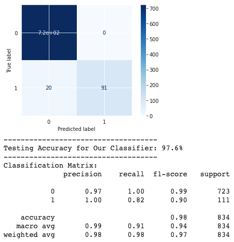
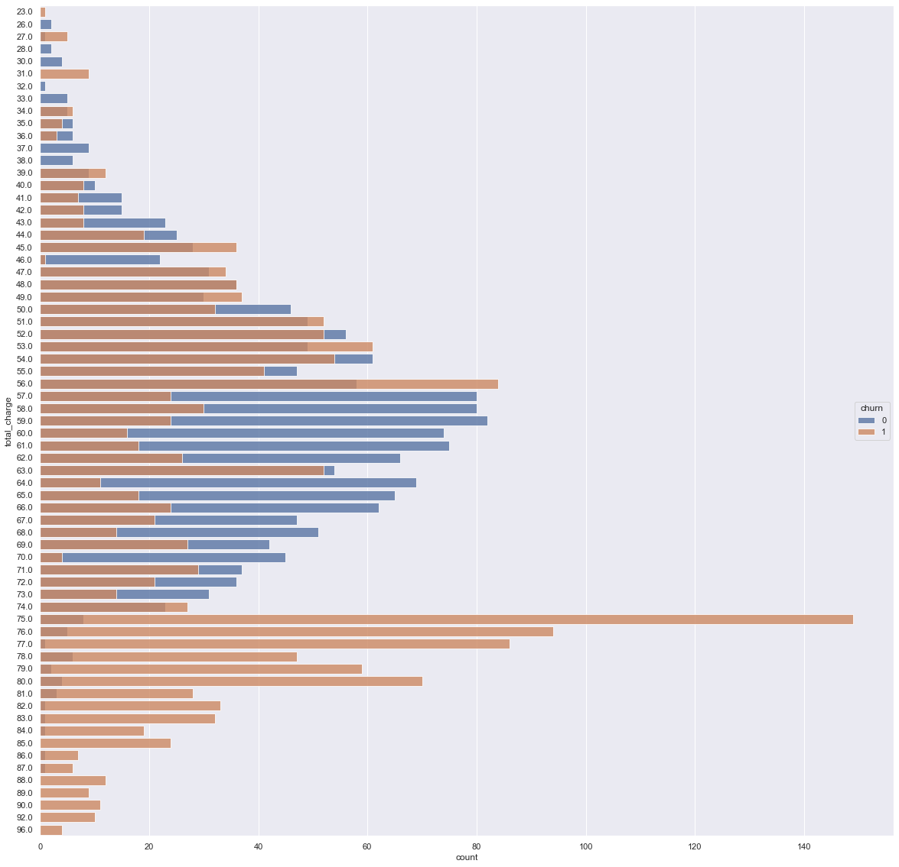
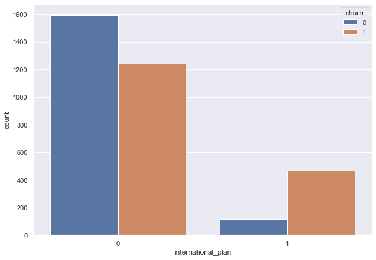
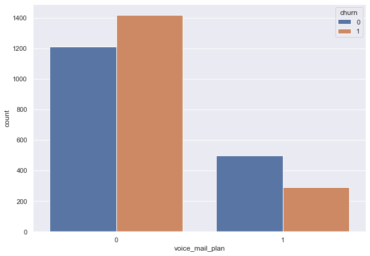
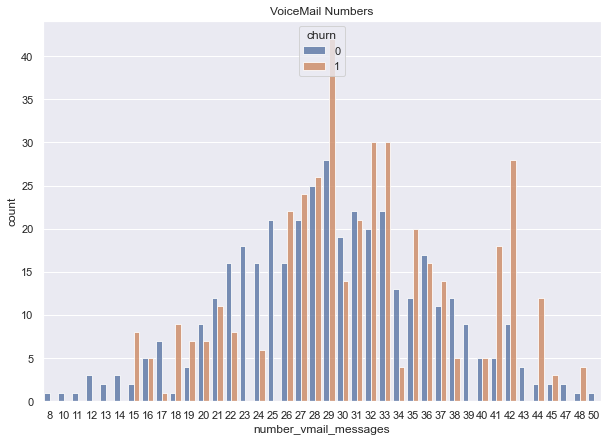
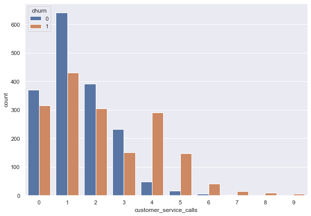

# CUSTOMER CHURN DATA

Build a classifier to predict whether a customer will ("soon") stop doing business with SyriaTel, a telecommunications company. Note that this is a binary classification problem.

Most naturally, the audience here would be the telecom business itself, interested in losing money on customers who don't stick around very long. 

## Objectives

- Determine which modeling method performs best for this dataset.
- Determine what are the most important top 3 features in our classification model.
- Determine the relationship between customer churn behavior and international plan.
- What is the relationship between the voicemail plan and customer churn? 
- What is the relationship between customer service calls and customer churn?

## What modeling algorithm works best for this dataset?

We used 5 Classification Model to create our base models and we tried to improve these models with different tuning methods. 

In light of of test results, ensemble methods predicted our churn data better than Logistic Regression and K Nearest Neighbors models. When we compare the ensembe methods withing themselves out best model for each ensemble models:

* _Decision Tree Model with GridSearch tuning_
* _Random Forest Model with Bagged Trees_
* _XGBoost Model with Base model_

The next step is deciding on which evaluation metrics is more impotant when predicting our customer churn rate. As a business, there are 2 important things: 
        1. Customers that churn
        2. Customers that stay who we predict that will churn (if company is spending extra money for these customer like ads, campaing... etc.)
        
As a business we will focus on what saves the most money. In this sense, we will focus on **PRECISION** and **F1-SCORE**.

$$ \text{Precision} = \frac{\text{Number of True Positives}}{\text{Number of Predicted Total Positives}} $$ 

$$ \text{F1-Score} = 2\ \frac{Precision\ x\ Recall}{Precision + Recall} $$

F1-Score is important because it penalizes if our model skews too hard towards either precision or recall. If our F1-Score is high, we can assume that our model is doing well. 

We compared all our best ensemble methods and concluded that our Base XGBoost Model predicts our binary classification model the best. 

We can interpret the confusion matrix above as:
    - Precision when predicting customers who stay is 0.97.
    - Precision when predicting customers who leave is 1.0.
    - Our model predicted all the customer who stayed correctly.
    - Our model predicted the customers who churn with 18% error.
    
Our number one goal with this classification is to predict the customers who will churn and prevent this happening in the future. As a business, we need to keep our revenue higher tham the cost. If we know which customers churn and why, we can spare budget to keep these people using our service. 

        
## What are the most important top 3 features in our classification model?

Top 5 features:
    1.   total_charge
    2.   voice_mail_plan
    3.   customer_service_calls
    4.   international_plan
    5.   total_intl_minutes
    
From business aspect, we will explore more about each of these features and find how we can make customers continue with their contract. 

The image below shows how the total charge affects customer churn behaviour. Customers who churn often pay more in average.

## What is the relationship between customer churn behavior and international plan?

The image above represents what is **international_plan** feature's role on customer churn rate given the churn and nonchurn classes have equal sample sizes. As we can see from the image, customers with international plan churn at a higher rate. We need to dig deeper the reasons behing why the customers with international plan churn more often. 

From multiple visualizations and EDA, our findings indicate that:

   - 80% of the customers with international plan churn. 
   - There is no extra fee for customer with international plan.
   - Customers with international plan and with no plan pays the same amount for long distance calls.
   - This indicates there is no advantage of having international plan. (Also no disadvantage since there is no international plan fee.)
   - Customers with the plan make longer international calls therefore they pay more _total_intl_charge_.
   
### Recommendations:

Based on our model _international_plan_ is one of the most important top 5 feature of our model. Customers with international plan are leaving the company at a 80% rate, which means of all the customers with international plan, 80% of them don't see value in our long distance service. We need to make our international plan option more attractive.
 
 
 
 
 ## What is the relationship between the voicemail plan and customer churn? 
 
 
 
 
The image above represents what is **voice_mail_plan** feature's role on customer churn rate given the churn and nonchurn classes have equal sample sizes. The image above shows only 23% of the customers are using voicemail plan and churn rate is higher among the customers with no voicemail plan. Of all the customers who churn, 83% of them do not have voicemail plan.

 

The number of the voicemail messages received almost follows a normal distribution with skews for both churn and nonchurn classes. People who receive more voic email messages in average tend to churn more often. But there is no relationship between the number of voicemail messages and account length or total calls.

### Recommendations:

Based on our model, _voice_mail_plan_ is the second most important feature. Of all the customers who churn, 83% of them do not have voicemail plan. And out of customers with international plan only 37% of them churn. We need to answer the questions like:

   - 'Do customers know about voicemail plan?'
   - 'If not, what can we do in order to increase voicemail plan option visibility?'
   - 'Do we need more budget for advertising or customer reach out?'
   - 'How can we make it more attractive for people to use?'

 
 
 
 ## What is the relationship between customer service calls and customer churn?
 
 The image below represents the _customer_service_calls_ feature's role on customer churn behaviour given the fact that class sample spaces are equal for our binary target. As we can see customers churn at a highter rate (87%) after 3 customer service phone calls.
 
  
 
 
 ### Recommendations:

Based on our model, _customer_service_calls_ is the third most important feature in our model when predicting customer churn behaviour. 87% of the customers who made more than 3 customers service calls left the company. We can think of the number of customer service calls as a representative of customer satisfaction/

In order to avoid this, we need to keep track of some questions below. The questions can differ depending on the marketing strategy the company selects.

   - Do customer service representative provide a solution to a customer about the problem they called about?
   - How often a customer call about the same problem?
   - Are customers satisfied with the customer service support?
   - What are the most common topics customer call about?
   - Can the company provide a overall solution from the default to avoid these calls? (i.e implementing a feature)
   - Are the customer service representatives knowledgable enough? Do they need extra training?
   - How good is the tech support?
 
 
 

## CONCLUSION

As a business, our revenue depends on customer satisfaction. We need to define our priorities and focus on these. XGBoost Ensemble method is the best model to predict customer churn behavior. Our model and exploratory data analysis similarly indicates some features have higher impact on customer churn behavior. In general, customers who pay higher bill, who made more customer service calls, who have international plan and make longer long distance calls and don't have voicemail plan churn at a higher rate. We need to provide solutions each of the problems seperately to prevent customer churn.
 
 

